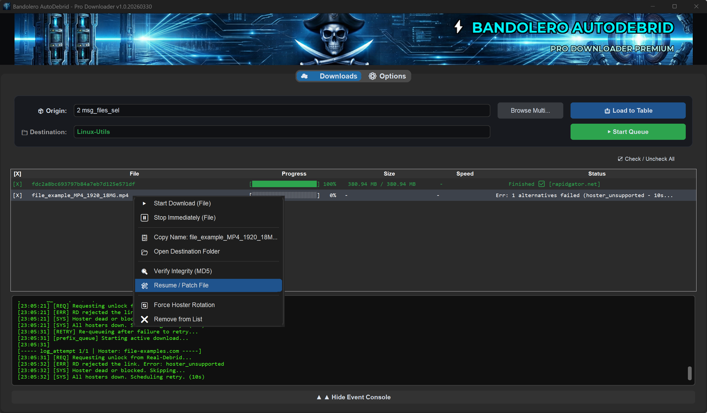

# Bandolero AutoDebrid 🚀🚢💀⚡⚓



A professional and robust download manager designed to automate file retrieval via **Real-Debrid**, featuring full support for DLC containers, TXT lists, and intelligent queue management.

> [!IMPORTANT]
> **External Service Requirement**: Bandolero is a bridge to Debrid services. It **requires an active Real-Debrid (AutoDebrid) API token** to function. This software does **NOT** implement native captcha solving; instead, it leverages the [Real-Debrid](https://real-debrid.com/) API to process protected links seamlessly.

---

## ✨ Key Features

- **Smart Queue Engine**: Manages simultaneous downloads while respecting your bandwidth limits. Excess files are automatically queued and processed in order.
- **Multi-Hoster Resilience**: Every file can have multiple sources. If a hoster fails (403, 503 errors, etc.), the engine automatically rotates to the next available mirror in the array.
- **Enterprise-Grade Encryption (DPAPI)**: Your **Real-Debrid API Token** is stored using the native Windows Data Protection API. It is encrypted specifically for your user account on your PC, making it unreadable even if the configuration file is compromised.
- **Session Persistence**: Automatically saves your download list, file selection state, and integrity reports. Upon reopening the app, everything resumes exactly where you left off.
- **Premium Modern UI**: Built with `CustomTkinter`, offering a sleek dark design, high-precision progress bars, and a detailed event console with a professional hacker aesthetic.
- **Seamless Registry Integration**: Custom Pirate Skull icon in the taskbar and a panoramic integrated header for a native software experience. 💀
- **On-the-Fly Hoster Rotation**: Encountering a slow hoster? Right-click any active download and select "Rotate Hoster" to switch servers instantly without losing progress.
- **Global Multilingual Support**: 100% localized interface, technical logs, and protocol traces in **Spanish (ES)**, **English (EN)**, **Russian (RU)**, and **Chinese (ZH)**.
- **Integrity Auditing (MD5)**: Integrated checksum verification system. Detects download inconsistencies with 100% accuracy and provides yellow visual feedback.
- **Smart File Repair**: If a file fails verification, Bandolero doesn't just delete it. It truncates the corrupt data and requests only the missing bytes from the server, repairing the file in seconds. 🛠️

---

## 📁 Project Structure

| File/Folder | Purpose |
| :--- | :--- |
| **`app_gui.py`** | The primary source code of the application. |
| **`build_exe.ps1`** | A PowerShell automation script to compile the source into a standalone EXE. |
| **`requirements.txt`** | List of Python dependencies for development environments. |
| **`app_icon.ico`** | High-resolution icon for the Windows taskbar and executable. |
| **`pirate_tech_banner_pro.png`** | The official glassmorphism header asset. |

---

## ⚙️ Configuration & Execution Files

### `config.json` (User Preferences & Security)
This file stores your persistent settings, such as download limits, UI font sizes, and default directories.
- **API Token Storage**: Your Real-Debrid token is **NOT stored in plain text**. It is obfuscated and protected by Windows DPAPI. This ensures that the token is tied to your hardware and Windows user profile.

### `session.json` (Download State Persistence)
This file acts as the "memory" of the application.
- It preserves your current file list, the status of each download, and whether a file is pending, completed, or failed.
- It also stores the results of integrity checks (MD5), allowing the app to remember which files were verified without re-scanning.

---

## 🛠️ Installation & Setup

### 1. Clone or Download
Ensure all files are placed in a local directory.

### 2. Install Dependencies
Open a terminal (PowerShell or CMD) in the project folder and run:

```bash
pip install -r requirements.txt
```

*Core libraries: `customtkinter`, `requests`, `pywin32`, `Pillow`, and `pycryptodome`.*

---

## 🚀 How to Use

1. **Initial Setup**:
   - Navigate to the **⚙️ Options** tab.
   - Paste your **Real-Debrid API Token**.
   - Select the **Base Directory** for your downloads.
   - Click **💾 Save Options**.

2. **Loading Links**:
   - Click **📥 Load Links** and select your `.dlc` or `.txt` files.
   - The app will automatically group mirrors by filename.

3. **Downloading**:
   - Define a **Final Subfolder** name (e.g., the name of the game/package).
   - Click **▶ Start Queue**. The dynamic engine will process files according to your simultaneous download limits.

---

## 📦 Building the Executable (.EXE)

To generate a standalone Windows binary with a custom icon and no background console:

1. **Environment Setup**:
   ```powershell
   pip install customtkinter Pillow requests pyinstaller
   ```

2. **Run the Build Script**:
   ```powershell
   powershell -ExecutionPolicy Bypass -File build_exe.ps1
   ```

3. **Output**:
   The final **`Bandolero_AutoDebrid.exe`** will be generated in the **`dist/`** folder. This file is portable and contains all embedded assets.

---

## 🛡️ Privacy Policy

- **Token Security**: We use `win32crypt.CryptProtectData` to bind your session to your local machine.
- **Transparency**: Logs are shown in the event console for debugging purposes but are not stored or sent to any third-party services.

---

**Engineered for precision and high-efficiency download management.**
